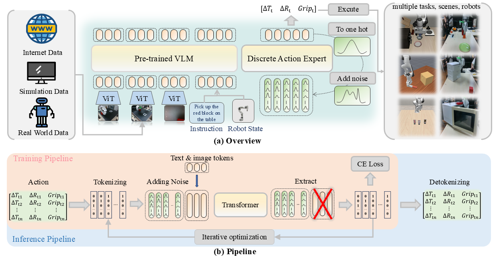

# $\mathcal{E}_0$: Enhancing Generalization and Fine-Grained Control in VLA Models via Tweedie Discrete Diffusion

<p align="center">
<a href="https://doo-mon.github.io/e0web/"></a>
<a href="https://arxiv.org/abs/2511.21542"></a>
<a href="https://github.com/Doo-mon/e0"></a>
<a href="https://huggingface.co/doomon/e0_diff_hybrid_libero"></a>
</p>

<p align="center">
Zhihao Zhan<sup>1</sup>, Jiaying Zhou<sup>1</sup>, Likui Zhang<sup>1</sup>, Qinhan Lyu<sup>1</sup>, Hao Liu<sup>1</sup>, Jusheng Zhang<sup>1</sup>, Weizheng Li<sup>1</sup>, Ziliang Chen<sup>1</sup>, Tianshui Chen<sup>3,4</sup>, Ruifeng Zhai<sup>1</sup>, Keze Wang<sup>1</sup>, Liang Lin<sup>1,2,3</sup>, Guangrun Wang<sup>*1,2,3</sup>
</p>

<p align="center">
<sup>1</sup>Sun Yat-sen University, <sup>2</sup>Guangdong Key Laboratory of Big Data Analysis and Processing, <sup>3</sup>X-Era AI Lab, <sup>4</sup>Guangdong University of Technology.
</p>

<p align="center">
<sup>*</sup>Corresponding author
</p>

## ✨ Abstract


Vision–Language–Action (VLA) models offer a unified framework for robotic manipulation by integrating visual perception, language understanding, and control generation. However, existing VLA systems still struggle to generalize across diverse tasks, scenes, and camera viewpoints, and often produce coarse or unstable actions. We argue that these limitations are closely tied to the structural properties of actions in VLA settings, including the inherent multi-peaked nature of action distributions, the token-based symbolic reasoning of pretrained VLM/VLA backbones, and the effective finite resolution imposed by real-world robotic control. Motivated by these properties, we introduce $\mathcal{E}_0$, a tweedie discrete diffusion framework that formulates action generation as iterative denoising over quantized action tokens. By operating in a discrete action space with a principled diffusion process, $\mathcal{E}_0$ naturally aligns with token-based reasoning, supports fine-grained yet executable action control, and avoids the distributional mismatch of masking-based discrete diffusion. We further introduce a spherical viewpoint perturbation augmentation to enhance robustness to camera shifts without additional data. Experiments on LIBERO, VLABench, ManiSkill, and a real-world Franka arm demonstrate that $\mathcal{E}_0$ achieves state-of-the-art performance across 14 diverse environments, outperforming strong baselines by 10.7\% on average.


## ⚙️ Setup (uv or conda)

### uv
We manage Python dependencies with [uv](https://docs.astral.sh/uv/). If you haven't installed `uv`, please follow [uv installation instructions](https://docs.astral.sh/uv/getting-started/installation/) to set it up.

Run the following to set up the environment:

```bash
git clone --recurse-submodules git@github.com:Doo-mon/e0.git

# Or if you already cloned the repo:
git submodule update --init --recursive

GIT_LFS_SKIP_SMUDGE=1 uv sync
GIT_LFS_SKIP_SMUDGE=1 uv pip install -e .
```

For more details, refer to the original [openpi repository](https://github.com/Physical-Intelligence/openpi).

### conda

You can use `environment.yml` to build the environment. Some additional packages may need to be installed manually depending on your setup.


## 🚀 Training / Inference / Deployment

### Data Preparation

Refers to ```/examples/libero/convert_libero_data_to_lerobot.py```

### Commands

Refers to `run_train.sh`, `run_server_eval.sh` and `run_local_eval.sh`


## Citation
If you find our work useful, please consider citing:

```bibtex
@misc{zhan2026e0enhancinggeneralizationfinegrained,
      title={E0: Enhancing Generalization and Fine-Grained Control in VLA Models via Tweedie Discrete Diffusion}, 
      author={Zhihao Zhan and Jiaying Zhou and Likui Zhang and Qinhan Lv and Hao Liu and Jusheng Zhang and Weizheng Li and Ziliang Chen and Tianshui Chen and Ruifeng Zhai and Keze Wang and Liang Lin and Guangrun Wang},
      year={2026},
      eprint={2511.21542},
      archivePrefix={arXiv},
      primaryClass={cs.RO},
      url={https://arxiv.org/abs/2511.21542}, 
}
```

## Acknowledgements

We express our sincere gratitude to the developers of [openpi](https://github.com/Physical-Intelligence/openpi) for open-sourcing their codebase.

## License

This project is licensed under the MIT License. See [LICENSE](LICENSE) for details.
